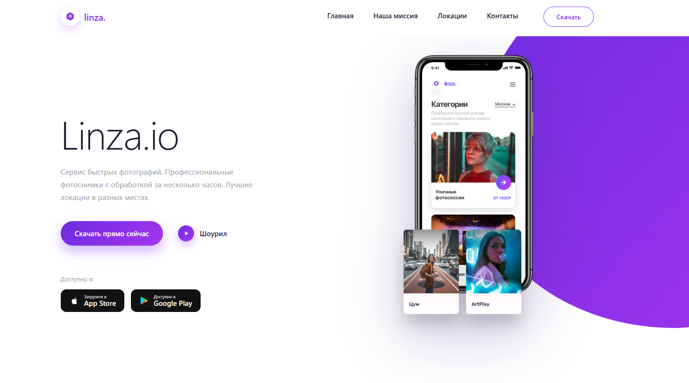

Photography Studio

A modern and responsive photography portfolio website built with React and JavaScript.

The website is designed for showcasing professional photo sessions, creative work, and photography services through a clean and visually focused interface.

Preview

Features
📸 Photography portfolio and gallery
🎞️ Photo session showcase
🖼️ Large visual image sections
👤 Photographer/service presentation
📩 Contact section
✨ Clean and modern UI
📱 Fully responsive design
⚡ Smooth and interactive user experience
🎨 Image-focused layout
Built With
React
JavaScript (ES6+)
CSS
Vite
Getting Started
1. Clone the repository
git clone https://github.com/mrd-test/photography-studio.git
2. Navigate to the project
cd photography-studio
3. Install dependencies
npm install
4. Start the development server
npm run dev

The application will be available at the local development URL provided by Vite.

Project Structure
photography-studio/
├── public/
│   └── screenshots/
│       └── preview.png
├── src/
│   ├── components/
│   ├── assets/
│   ├── App.jsx
│   ├── main.jsx
│   └── index.css
├── .gitignore
├── index.html
├── package.json
└── README.md
What I Learned

This project helped me practice:

Building reusable React components
Managing component structure
Working with dynamic content
Creating image-focused layouts
Building responsive interfaces
Working with CSS and modern layouts
Handling user interactions
Organizing a React project with Vite
Creating a visually appealing portfolio website
Available Scripts
Command	Description
npm run dev	Starts the development server
npm run build	Creates a production build
npm run preview	Previews the production build
Future Improvements
📅 Online photo session booking
🖼️ Advanced gallery with categories
🔍 Full-screen image viewer
💬 Customer testimonials
📧 Contact form integration
🌐 Multi-language support
🌙 Dark mode
License

This project is open source and available under the MIT License.